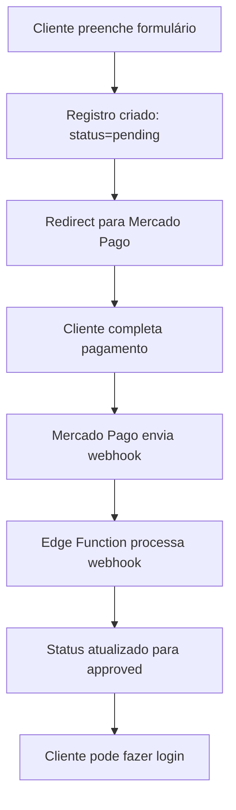

# Configuração do Webhook do Mercado Pago

## Objetivo

Este documento explica como configurar o webhook do Mercado Pago para que o sistema receba notificações automáticas quando um pagamento for aprovado, rejeitado ou estiver pendente.

## Por que o Webhook é Necessário?

Atualmente, quando um cliente completa o pagamento no Mercado Pago:

1. ✅ O registro é criado na tabela `subscribers` com `status='pending'`
2. ✅ O cliente é redirecionado para o Mercado Pago
3. ❌ **Sem webhook**: O status não é atualizado automaticamente
4. ❌ O cliente não consegue fazer login (requer `status='approved'`)

**Com o webhook configurado:**
- O Mercado Pago notifica automaticamente o sistema quando o pagamento é confirmado
- O status do subscriber é atualizado para `approved`
- O cliente pode fazer login imediatamente após o pagamento

## Passo a Passo da Configuração

### 1. Obter a URL do Webhook

A URL do webhook já está deployada no Supabase:

```
https://wmivufnnbsvmeyjapjzx.supabase.co/functions/v1/mercadopago-webhook
```

### 2. Acessar o Painel do Mercado Pago

1. Acesse: https://www.mercadopago.com.br/developers/panel
2. Faça login com sua conta
3. Selecione sua aplicação

### 3. Configurar Notificações

1. No menu lateral, clique em **"Notificações"** ou **"Webhooks"**
2. Clique em **"Configurar notificações"** ou **"Adicionar webhook"**
3. Preencha os campos:

   **URL de notificação:**
   ```
   https://wmivufnnbsvmeyjapjzx.supabase.co/functions/v1/mercadopago-webhook
   ```

   **Eventos a monitorar:**
   - ✅ `payment` (Pagamentos)
   
   **Modo:**
   - Selecione o ambiente (Produção ou Teste) de acordo com suas credenciais

4. Clique em **"Salvar"** ou **"Criar"**

### 4. Testar o Webhook

Após configurar, você pode testar:

1. Faça um pagamento de teste usando as credenciais de teste do Mercado Pago
2. Verifique os logs da Edge Function no Supabase:
   - Acesse: https://supabase.com/dashboard/project/wmivufnnbsvmeyjapjzx/functions/mercadopago-webhook/logs
3. Verifique se o status foi atualizado na tabela `subscribers`

### 5. Verificar Configuração

Para verificar se o webhook está configurado corretamente:

1. No painel do Mercado Pago, vá em **"Notificações"**
2. Você deve ver a URL do webhook listada
3. Status deve estar **"Ativo"**

## Variáveis de Ambiente Necessárias

O webhook já está configurado com as seguintes variáveis no Supabase:

- ✅ `MERCADO_PAGO_ACCESS_TOKEN` - Token de acesso do Mercado Pago
- ✅ `APP_SUPABASE_URL` - URL do projeto Supabase
- ✅ `APP_SUPABASE_SERVICE_ROLE_KEY` - Chave de serviço do Supabase

## Fluxo Completo com Webhook



## Troubleshooting

### Webhook não está sendo recebido

1. Verifique se a URL está correta no painel do Mercado Pago
2. Verifique os logs da Edge Function no Supabase
3. Certifique-se de que está usando as credenciais corretas (Produção vs Teste)

### Status não está sendo atualizado

1. Verifique os logs da Edge Function para erros
2. Confirme que as variáveis de ambiente estão configuradas
3. Verifique se o `external_reference` está sendo salvo corretamente

### Como testar manualmente

Você pode simular um webhook usando curl:

```bash
curl -X POST https://wmivufnnbsvmeyjapjzx.supabase.co/functions/v1/mercadopago-webhook \
  -H "Content-Type: application/json" \
  -d '{
    "type": "payment",
    "data": {
      "id": "SEU_PAYMENT_ID_AQUI"
    }
  }'
```

## Referências

- [Documentação de Webhooks do Mercado Pago](https://www.mercadopago.com.br/developers/pt/docs/your-integrations/notifications/webhooks)
- [Painel de Desenvolvedores](https://www.mercadopago.com.br/developers/panel)
